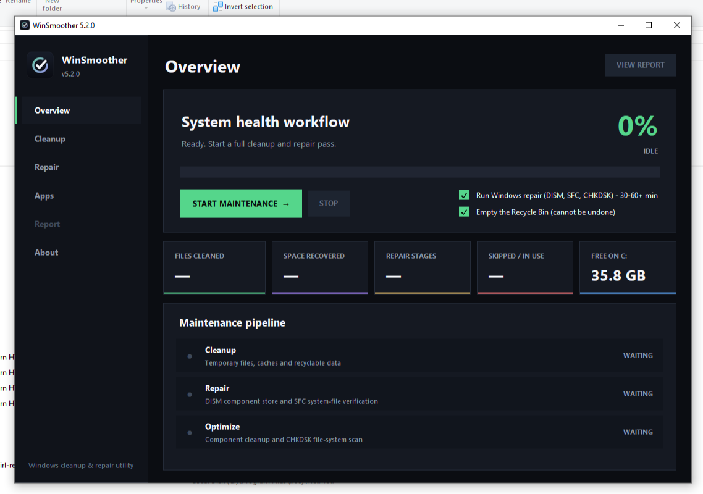
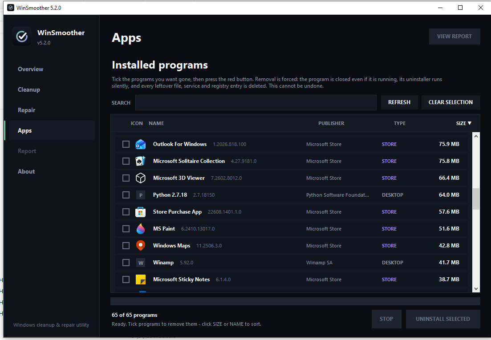
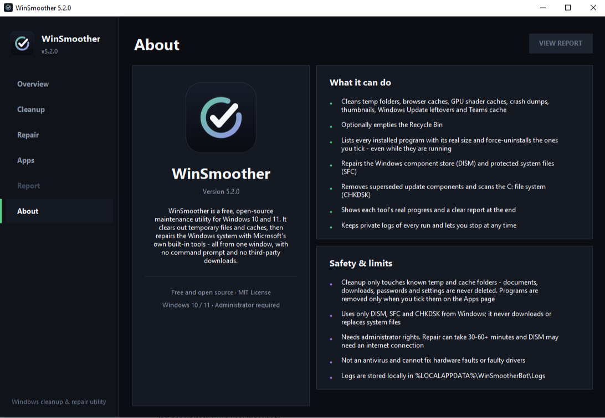

<p align="center">
  
</p>

<h1 align="center">WinSmoother</h1>

<p align="center">
  <b>Clean, repair and de-bloat Windows 10 / 11 from one window.</b><br>
  Free, open source, no command prompt, no third-party downloads.
</p>

<p align="center">
  <a href="../../releases"></a>
  
  
  <a href="LICENSE.txt"></a>
</p>

<p align="center">
  
</p>

---

## Why WinSmoother?

Windows slowly fills up with temporary files, browser caches, crash dumps and programs you no longer use,
and fixing a damaged system normally means typing `DISM`, `SFC` and `CHKDSK` commands by hand.
WinSmoother does all of that for you, shows **real progress**, asks before it does anything,
and lets you stop at any time.

## Features

| | |
|---|---|
| **Cleanup** | Temp folders, browser caches (Chrome, Edge, Brave, Firefox, all profiles), GPU shader caches, crash dumps, thumbnails, Windows Update leftovers, Teams cache, and optionally the Recycle Bin. |
| **Repair** | `DISM /RestoreHealth`, `SFC /scannow`, `DISM /StartComponentCleanup` and `CHKDSK C: /scan`, using only Microsoft's own tools. |
| **Apps (force uninstall)** | Lists every installed program (desktop and Microsoft Store) with its **icon** and real size on disk, with search and sorting. Tick the ones you want gone and press **UNINSTALL SELECTED**. |
| **Real progress** | Each tool's own percentage is read live and mapped onto the progress bar. |
| **Real free space** | "Space recovered" is measured from the drive itself (free space before vs. after), so it matches what Windows shows. |
| **You stay in control** | Confirmation before starting, optional Recycle Bin and repair steps, and a **Stop** button. |
| **Report and logs** | Per-stage results in plain language. Private logs are kept in `%LOCALAPPDATA%\WinSmootherBot\Logs` (last 15 runs). |

## Screenshots

<p align="center">
  <br>
  <sub><b>Apps</b>: every installed program with its icon, publisher, type and real size.</sub>
</p>

<p align="center">
  <br>
  <sub><b>About</b>: what the tool does and what its limits are.</sub>
</p>

## Download and install

1. Open the [**Releases**](../../releases) page and download `WinSmootherBot.exe`.
2. Double-click it and approve the Windows UAC prompt (administrator rights are required for DISM / SFC / CHKDSK).
3. That's it. It is a single portable file, with nothing to install.

> **Note:** the file is not code-signed, so Windows SmartScreen may show an "unknown publisher" warning.
> Click **More info, then Run anyway**. Some antivirus programs also flag PyInstaller-built apps by mistake.
> If you prefer, [build it yourself](#build-from-source) from the source code.

## How to use

1. **Overview**: choose whether to run Windows repair and empty the Recycle Bin, then press **START MAINTENANCE**.
   Repair can take 30-60+ minutes. You can press **STOP** at any time.
2. **Cleanup / Repair**: see exactly what each step does.
3. **Apps**: search the list, tick the programs you want removed and press **UNINSTALL SELECTED**.
   You get a confirmation first. Removal is forced and cannot be undone.
4. **Report**: review the result of every stage and open the logs folder.

### What "force uninstall" does

1. Stops the program's services and closes every process running from its folder.
2. Runs the program's own uninstaller silently (with a timeout, so a stuck one cannot block the process).
3. Deletes leftover services and wipes the install folder. Files that are locked are removed at the next restart.
4. Removes the program's entry from the registry so it disappears from Windows.

Microsoft Store apps are removed with `Remove-AppxPackage`.

## Safety

- Cleanup only touches **known temp and cache folders**. Documents, downloads, passwords and settings are never deleted.
- The Apps page deletes **only what you tick**, after a confirmation.
- System, profile and shared folders (Windows, Program Files itself, Users, Documents, ...) are **never wiped**.
- Runtimes and drivers other programs may rely on are flagged **SYSTEM**.
- Junctions and symlinks are never followed, and the running app protects itself.
- WinSmoother never downloads or replaces system files. Never replace Windows DLLs with files from third-party websites.

> **Disclaimer:** force uninstall is irreversible. Review your selection carefully.
> WinSmoother is not an antivirus and cannot fix hardware faults or faulty drivers.
> The software is provided "as is" without warranty (see [LICENSE.txt](LICENSE.txt)).

## FAQ

**Does it need an internet connection?** Not normally. DISM may need one to repair the component store.

**Where are the logs?** In `%LOCALAPPDATA%\WinSmootherBot\Logs`. Use **Open logs folder** on the Report page.

**Why does it ask for administrator rights?** DISM, SFC and CHKDSK, and removing programs, require them.

**Some programs show a letter instead of an icon.** Those programs don't register an icon with Windows. They work the same way.

## Build from source

Requires Windows 10/11 and Python 3.9+ (python.org installer, includes tkinter). No extra packages are needed to run it.

```
git clone https://github.com/angeryangle98-lgtm/WinSmoother.git
cd WinSmoother
py main.py
```

To build the single-file executable:

```
build.bat
```

Output: `dist\WinSmootherBot.exe` (requests administrator rights via UAC).

## Project structure

```
main.py       entry point (admin check, single-instance guard)
gui.py        Tkinter interface
cleaner.py    temp / cache cleanup
repair.py     DISM, SFC and CHKDSK stages
apps.py       installed-program discovery, icons, forced removal
utils.py      logging, process handling, helpers
assets/       logo and icon
docs/         screenshots
```

## Contributing

Bug reports and pull requests are welcome. Please open an [issue](../../issues) first for larger changes,
and attach the log file from `%LOCALAPPDATA%\WinSmootherBot\Logs` when reporting a problem.

## Support the project

WinSmoother is free and always will be. If it saved you time, you can support its development with the
**Sponsor** button at the top of this repository. Thank you!

## Changelog

### 5.2.0
- Fixed: program name in the sidebar and the About text were cut off; Store app names such as "3D Viewer" are now shown correctly.
- New: icon column in the Apps list (desktop programs and Microsoft Store apps). Icons load in the background; a letter placeholder shows until the real icon arrives.

### 5.1.0
- Fixed: **Space recovered** now shows the real free-space difference on the Windows drive instead of the sum of deleted file sizes (which ignored the Recycle Bin, cluster slack and DISM savings). New "Free on C:" card.
- New: **Apps** page - all installed programs with real size, tick boxes, search, sorting, and a forced "UNINSTALL SELECTED" button (closes running programs, silent uninstall, wipes leftovers, cleans registry; Store apps via Remove-AppxPackage).
- Safer event loop: one failed UI update can no longer freeze the progress display.

### 5.0.1
- Repair stages no longer look frozen: DISM prints no live percentage when piped, so the app now shows elapsed time, a slowly advancing bar and an explanation; the Stop dialog warns that repair can take 30-60+ minutes.

### 5.0.0
- Fixed: app crashed on **Start** (progress bar was never created).
- Fixed: summary cards had zero height and were invisible.
- Fixed: repair progress was fake (output was only read after the tool finished). Output is now streamed live, including DISM's `\r` redraws and SFC's UTF-16 output.
- Fixed: CHKDSK exit codes 1/2 and DISM 3010 were reported as errors.
- Fixed: report duration kept growing every time it was opened.
- Fixed: thumbnail cleanup was dead code; Delivery Optimization path was hard-coded to `C:`.
- Fixed: Windows Update services are now always restarted, even on error/cancel.
- Safer: no longer deletes Teams IndexedDB; accurate file/byte counts; junction-safe deletion.
- Retry for `0xC000013A` now uses a different hidden-console launch mode.
- New: professional logo/icon, About page, Stop button, options, confirmation dialog,
  High-DPI support, single-instance guard, "Open logs folder", log retention, UAC manifest.

## License

MIT. See [LICENSE.txt](LICENSE.txt).
